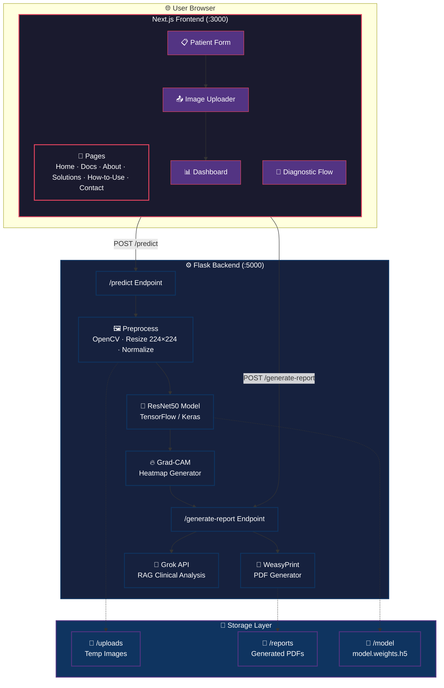
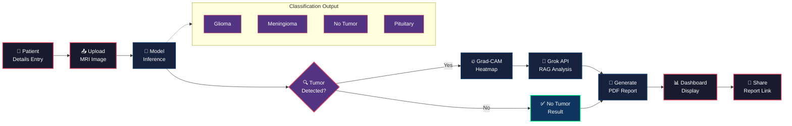

<div align="center">
  <br/>
  
  <br/><br/>

  # NeuroScan AI — Brain Tumor MRI Classification

  **Explainable Deep Learning for Brain Tumor Diagnostics**

  <p align="center">
    
    
    
    
    
    
    
    
    
    
    
  </p>

  <br/>

  [](https://github.com/Moiz2003/neuroscan)
  [](https://github.com/Moiz2003/neuroscan)
  [](https://github.com/Moiz2003/neuroscan/blob/main/LICENSE)
  [](http://makeapullrequest.com)

</div>

> ⚠️ **IMPORTANT MEDICAL DISCLAIMER**
>
> **NeuroScan is a research and educational tool only. It is NOT a medical device and has NOT been cleared or approved by the FDA, EMA, or any other regulatory body.**
>
> - This software is provided **for diagnostic assistance and research purposes only**
> - It **must not** be used as a sole basis for clinical decision-making
> - All diagnoses should be verified by a qualified medical professional
> - The developers assume **no liability** for any clinical decisions or patient outcomes resulting from the use of this software
> - Always consult a licensed physician for medical advice

---

## 📋 Table of Contents

- [Overview](#-overview)
- [Tech Stack](#-tech-stack)
- [Architecture](#-architecture)
- [Business Logic & Workflow](#-business-logic--workflow)
- [Model Architecture](#-model-architecture)
- [Features](#-features)
- [Getting Started](#-getting-started)
- [API Endpoints](#-api-endpoints)
- [Project Structure](#-project-structure)
- [Team](#-team)
- [License](#-license)

---

## 📖 Overview

**NeuroScan** is a full-stack AI-powered web application that allows clinicians to upload brain MRI scans and receive **real-time classification** with **explainable AI visualizations**. Built on a **ResNet50** deep learning backbone, it classifies scans into four categories — *Glioma, Meningioma, Pituitary Tumor, or No Tumor* — and generates **Grad-CAM heatmaps** to highlight the regions influencing each prediction.

The system produces **AI-generated clinical PDF reports** via a RAG (Retrieval-Augmented Generation) pipeline powered by the **Grok API**, making it a complete diagnostic assistant for radiology workflows.

---

## 🛠️ Tech Stack

### Frontend

| Technology | Purpose |
|------------|---------|
| [](https://nextjs.org/) | React framework with file-based routing & SSR |
| [](https://react.dev/) | UI component library |
| [](https://www.framer.com/motion/) | Animation library for smooth transitions |
| [](https://threejs.org/) | 3D brain visualization |
| [](https://lucide.dev/) | Icon library |

### Backend

| Technology | Purpose |
|------------|---------|
| [](https://flask.palletsprojects.com/) | Python web framework |
| [](https://www.tensorflow.org/) | Deep learning framework |
| [](https://keras.io/) | High-level neural network API |
| [](https://opencv.org/) | Image preprocessing |
| [](https://numpy.org/) | Numerical computation |
| [](https://weasyprint.org/) | PDF report generation |
| [-1DA1F2?logo=x&logoColor=white)](https://x.ai/) | RAG-based clinical analysis |

### Model

| Component | Detail |
|-----------|--------|
| **Base Architecture** | ResNet50 (custom-trained from scratch on our dataset) |
| **Input Shape** | 224 × 224 × 3 |
| **Top Layers** | GAP → Dense(256, ReLU) → Dropout(0.5) → Dense(4, Softmax) |
| **Classes** | Glioma, Meningioma, No Tumor, Pituitary Tumor |
| **Explainability** | Grad-CAM (conv5_block3_out layer) |
| **Weights** | 180 MB (`model.weights.h5`) — trained from scratch in Jupyter Notebook |

---

## 🏗️ Architecture



---

## 🔄 Business Logic & Workflow

### End-to-End Flow



### Detailed Business Logic

#### 1. 🏥 Patient Information Intake
- Clinician enters patient name, age, and clinical notes
- Data is stored in-memory and passed to the report generator

#### 2. 📤 MRI Image Upload
- Supported formats: JPG, PNG
- Image is validated and temporarily stored in `/uploads`
- Frontend displays a preview before submission

#### 3. 🧠 Model Inference (`POST /predict`)
- Image is preprocessed: decoded via OpenCV → BGR to RGB → resized to 224×224 → normalized (÷255)
- Custom-trained ResNet50 model runs inference → outputs softmax probabilities over 4 classes
- **Prediction logic:**
  - If max probability > threshold → predicted class
  - Confidence score = max probability × 100
  - If class ≠ "No Tumor" → tumor detected → proceed to Grad-CAM

#### 4. 🔥 Grad-CAM Explainability
- Only triggered when a tumor is detected
- Computes gradients of the predicted class score w.r.t. `conv5_block3_out` feature maps
- Generates a coarse heatmap → overlays it on the original MRI
- Extracts tumor location description from heatmap coordinates
- **Output:** Base64-encoded heatmap overlay image + location text

#### 5. 🤖 AI Clinical Analysis (RAG)
- Patient details + diagnosis + confidence + location → sent to **Grok API**
- RAG (Retrieval-Augmented Generation) produces a clinical-grade analysis
- Includes: diagnosis summary, tumor characteristics, recommendations

#### 6. 📄 PDF Report Generation (`POST /generate-report`)
- Jinja2 template renders an HTML report with:
  - Patient details, diagnosis, confidence score
  - Original MRI + Grad-CAM overlay images
  - AI-generated clinical analysis
  - Doctor's notes (editable)
- WeasyPrint converts HTML → PDF
- PDF saved to `/reports` with UUID filename
- Returns a secure short link for sharing

#### 7. 📊 Dashboard Display
- Frontend displays:
  - Diagnosis with color-coded confidence badge
  - Side-by-side original vs. Grad-CAM view
  - AI analysis text
  - Report generation button
  - Short link copy functionality

---

## ✨ Features

| Feature | Description |
|---------|-------------|
| 🧠 **Deep Learning Engine** | Custom-trained ResNet50 classifier with 95%+ accuracy across 4 diagnostic classes |
| 🔥 **Grad-CAM Visualization** | Explainable AI heatmaps highlighting tumor regions |
| 📄 **AI-Generated Reports** | Automated PDF reports with clinical analysis via Grok API |
| 🛡️ **HIPAA-Ready Design** | Privacy-first architecture with secure report sharing |
| ⚡ **Real-Time Inference** | Sub-second predictions on GPU-accelerated infrastructure |
| 🩺 **Clinical Workflow** | 3-step flow: patient info → upload → diagnosis |
| 🎨 **Modern UI** | Dark theme, glassmorphism, Framer Motion animations |
| 📱 **Responsive** | Full mobile support with hamburger navigation |

---

## 🚀 Getting Started

### Prerequisites

- Python 3.11+
- Node.js 18+
- pip / npm

### Model Training (Optional — weights already provided)

The model was trained from scratch using our custom Jupyter notebook pipeline:

```bash
# Train the model yourself
jupyter notebook modeltrainig.ipynb
```

The training notebook covers:
- Dataset loading & preprocessing
- ResNet50 architecture definition (from scratch, no pre-trained weights)
- Training loop with validation
- Model evaluation & confusion matrix
- Weight export to `model.weights.h5`

### Backend Setup

```bash
cd neuroscan/backend
pip install -r requirements.txt
python app.py
```

The backend starts at **http://localhost:5000**.

### Frontend Setup

```bash
cd neuroscan/frontend
npm install
npm run dev
```

The frontend starts at **http://localhost:3000**.

---

## 📡 API Endpoints

### `POST /predict`
Upload an MRI scan for diagnosis.

| Parameter | Type | Description |
|-----------|------|-------------|
| `file` | File (multipart) | MRI image (JPG/PNG) |
| `patientDetails` | String (JSON) | Optional patient info |

**Response:**
```json
{
  "diagnosis": "Glioma",
  "confidence": 0.9876,
  "gradCamImage": "base64...",
  "originalImage": "base64...",
  "locationText": "Right temporal lobe",
  "locationCoords": [120, 85, 160, 130],
  "llmAnalysis": "Clinical analysis text...",
  "patientDetails": { "name": "...", "age": 45 }
}
```

### `POST /generate-report`
Generate a PDF report from diagnosis data.

| Parameter | Type | Description |
|-----------|------|-------------|
| `diagnosis` | String | Diagnosis label |
| `confidence` | Float | Confidence score |
| `originalImage` | String | Base64 original image |
| `gradCamImage` | String | Base64 heatmap overlay |
| `locationText` | String | Tumor location |
| `doctorNotes` | String | Clinician notes |
| `llmAnalysis` | String | AI-generated analysis |
| `patientDetails` | Object | Patient information |

**Response:**
```json
{
  "success": true,
  "report_id": "uuid",
  "report_url": "http://127.0.0.1:5000/reports/uuid"
}
```

### `GET /reports/<report_id>`
Download a generated PDF report.

---

## 📁 Project Structure

```
neuroscan/
├── backend/
│   ├── app.py                 # Flask API (routes, model loading, inference)
│   ├── gradcam.py             # Grad-CAM heatmap generation
│   ├── llm_engine.py          # Grok API RAG analysis
│   ├── requirements.txt       # Python dependencies
│   ├── .env                   # API keys (Grok)
│   ├── model/
│   │   ├── config.json        # Model architecture config
│   │   ├── metadata.json      # Model metadata
│   │   └── model.weights.h5   # Pre-trained weights (180 MB)
│   ├── templates/
│   │   └── report.html        # Jinja2 PDF template
│   ├── uploads/               # Temporary image storage
│   └── reports/               # Generated PDF reports
│
├── frontend/
│   ├── app/
│   │   ├── layout.js          # Root layout (Navbar + Footer)
│   │   ├── page.js            # Home (landing + diagnostic flow)
│   │   ├── globals.css        # Global styles
│   │   ├── about/page.js      # About Us page
│   │   ├── contact/page.js    # Contact page
│   │   ├── docs/page.js       # Documentation page
│   │   ├── how-to-use/page.js # How to Use guide
│   │   └── solutions/page.js  # Solutions page
│   ├── components/
│   │   ├── Navbar.js          # Navigation bar
│   │   ├── Footer.js          # Site footer
│   │   ├── Dashboard.js       # Results dashboard
│   │   ├── ImageUploader.js   # MRI upload component
│   │   ├── PatientForm.js     # Patient info form
│   │   └── Brain3DView.js     # 3D brain visualization
│   ├── package.json
│   └── next.config.mjs
│
├── documentation/
│   └── F26-07.pdf             # Research paper
│
├── confusion matrix.ipynb     # Model evaluation notebook
├── modeltrainig.ipynb         # Training notebook
├── imagesprocessing.ipynb     # Data preprocessing notebook
└── README.md
```

---

## 👥 Team

<div align="center">

| | | |
|:---:|:---:|:---:|
| **Moiz** | **Moeed** | **Auon** |
| *Researcher* | *Researcher* | *Researcher* |

</div>

---

## 📄 License

This project is licensed under the **MIT License** — see the [LICENSE](LICENSE) file for details.

```
MIT License

Copyright (c) 2026 NeuroScan Diagnostic Assistant

Permission is hereby granted, free of charge, to any person obtaining a copy
of this software and associated documentation files (the "Software"), to deal
in the Software without restriction, including without limitation the rights
to use, copy, modify, merge, publish, distribute, sublicense, and/or sell
copies of the Software, and to permit persons to whom the Software is
furnished to do so, subject to the following conditions:

The above copyright notice and this permission notice shall be included in all
copies or substantial portions of the Software.

THE SOFTWARE IS PROVIDED "AS IS", WITHOUT WARRANTY OF ANY KIND, EXPRESS OR
IMPLIED, INCLUDING BUT NOT LIMITED TO THE WARRANTIES OF MERCHANTABILITY,
FITNESS FOR A PARTICULAR PURPOSE AND NONINFRINGEMENT. IN NO EVENT SHALL THE
AUTHORS OR COPYRIGHT HOLDERS BE LIABLE FOR ANY CLAIM, DAMAGES OR OTHER
LIABILITY, WHETHER IN AN ACTION OF CONTRACT, TORT OR OTHERWISE, ARISING FROM,
OUT OF OR IN CONNECTION WITH THE SOFTWARE OR THE USE OR OTHER DEALINGS IN THE
SOFTWARE.
```

---

<div align="center">
  <br/>
  <p>
    Built with ❤️ for better healthcare diagnostics
  </p>
  <p>
    <a href="https://github.com/Moiz2003/neuroscan">GitHub</a> ·
    <a href="http://localhost:3000">Live Demo</a> ·
    <a href="http://localhost:3000/contact">Contact</a>
  </p>
  <br/>
</div>
